# 🕵️‍♂️ AI-TruthScan: Real-Time Interview Integrity & AI Detection

### *Verify Candidate Authenticity through Multi-Modal Analysis*

<div align="center">

</div>

---

## 🌟 Overview

**AI-TruthScan** is a specialized recruitment intelligence tool designed to ensure fair hiring in the age of generative AI. By analyzing audio and video recordings, the system detects whether interview responses are likely **human-created** or **AI-generated**.

Leveraging **Google Gemini** for linguistic analysis and **MediaPipe** for gaze-tracking, AI-TruthScan provides recruiters with a "Truth Score" based on verbal patterns and physical cues like script-reading behavior.

## ✨ Key Features

### 🎙️ **Multi-Modal Analysis**

Analyze both audio and video files. The system handles everything from speech-to-text transcription to visual behavioral checks.

### 🧠 **AI-Generation Detection**

Utilizes advanced LLMs (Google Gemini) to identify synthetic speech patterns and classify responses as "Real" or "Fake" with associated confidence scores.

### 👁️ **Gaze Tracking & Script Detection**

Uses **OpenCV** and **MediaPipe** to track eye movement in real-time, helping to identify if a candidate is reading from an off-screen script.

### 📊 **Recruiter Insights Dashboard**

A streamlined **Streamlit** interface that provides detailed authenticity reports and stores historical analysis in a persistent SQLite database.

---

## 🛠️ Technologies Used

| Layer | Technology | Purpose |
| --- | --- | --- |
| **Frontend** |  | Interactive User Interface |
| **Backend** |  | RESTful API Service |
| **AI / NLP** |  | Linguistic classification |
| **Computer Vision** |  | Gaze and movement tracking |
| **Audio** |  | Audio-to-text transcription |

---

## 🚀 System Workflow

```mermaid
graph TD
    A[📹 Audio/Video Upload] --> B[🔉 Transcription Engine]
    A --> C[👁️ Gaze Tracking Engine]
    B --> D[🧠 Google Gemini Analysis]
    C --> E[📊 Behavioral Cues]
    D --> F{Integrity Check}
    E --> F
    F --> G[📑 Final Truth Report]
    G --> H[(SQLite Database)]

```



---

## 📁 Recommended Repository Structure

To match a professional standard, organize your project as follows:

```text
📂 AI-TruthScan/
├── 📂 backend/                 # Flask API and AI Logic
│   ├── app.py                  # API Endpoints
│   └── analysis_engine.py      # Gemini & MediaPipe Logic
├── 📂 frontend/                # Streamlit Web App
│   └── app.py                  # User Interface
├── 📂 database/                # SQLite Storage
├── 📂 docs/                    # PPTs and Reports
├── 📄 requirements.txt         # Centralized Dependencies
├── 📄 LICENSE                  # MIT License
└── 📄 README.md                # This File

```

---

## 💻 Installation & Usage

### 🔧 Setup

1. **Clone & Navigate**:
```bash
git clone https://github.com/yourusername/AI-TruthScan.git
cd AI-TruthScan

```


2. **Install Dependencies**:
```bash
pip install -r requirements.txt

```


3. **Configure API Key**:
Replace the placeholder in `backend/app.py` with your **Google Gemini API Key**.

### 🚀 Execution

1. **Start Backend**: `cd backend && python app.py`
2. **Start Frontend**: `cd frontend && streamlit run app.py`

---

## 👥 Project Contributors

* **Anusha G E**: Lead Developer
* **Kashif**: UI Designer
* **Keerthana H**: PPT & Feedback
* **Prajwal**: UI & Reporting
* **Ayush Kumar**: Quality Assurance
* **Reetish Kulkarni**: Documentation

---

<div align="center">

**[View Demo Video](https://drive.google.com/file/d/1eUJZOWN5XeO3HeA1ej7Afe2amaSt7ijZ/view?usp=drive_link)**

---

**⭐ If this tool helps your recruitment process, please consider giving it a star! ⭐**

*"Bridging the gap between AI innovation and human integrity"*

</div>
